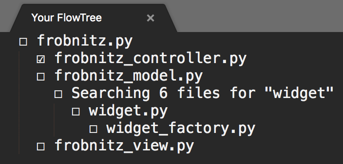

# FlowTree

Cognitive science research shows that humans can only store a few things in our working memory at once.  So what happens when programmers do tasks that are too big to fit in our working memory?  You're debugging the frobnitz, and midway through you realize that the simplest fix involves refactoring the widget, which in turn requires reworking the widget factory.  By the time you're back at the frobnitz, the frobnitz-related info that was in your working memory has been replaced.  You waste time recovering that lost context, and you may introduce bugs if you misremember what's been done or forget something that needs to be done.

FlowTree is a Sublime Text plugin designed to help with this problem.  By automatically building a diagram of the files you open and why you open them, it can help you make complicated code changes faster and more reliably.

## Installation

To install via Package Control, run the 'Package Control: Install Package' command and choose the FlowTree package.

To install manually, e.g. if you want to do development, clone the repository into the Packages directory in your Sublime Text 3 settings folder.

## Usage

Open a file from a codebase you're working on and run the 'FlowTree: Show FlowTree' command.  You should get a new buffer titled Your FlowTree that tracks your editing workflow.

In this example, the user is fixing a frobnitz-related bug that requires making changes to the frobnitz model, the frobnitz view, and the frobnitz controller.  Because frobnitz.py was the file that was open immediately before each of frobnitz_controller.py, frobnitz_model.py, and frobnitz_view.py were opened, they are each displayed as children of frobnitz.py.  Midway through fixing frobnitz_model.py, the user realizes that widget needs a refactor and searches the repository for the string "widget".  Partway through editing widget.py, they open widget_factory.py to make some changes there.  At each stage, it's possible to see where the user is in the task as a whole and what still needs to be done.

As buffers get closed, the empty box ☐ turns into a checked box to indicate completion of that part of the task.  In the above screenshot, the user finished making modifications to frobnitz_controller.py and closed the file, causing its box to become checked.  When the very first buffer which was opened gets closed, the entire FlowTree diagram disappears to get ready for the next task.

To provide further reminders about where you are in your editing workflow, if you leave text selected in a buffer before opening a new buffer, the text you left selected gets displayed alongside the old buffer in the FlowTree diagram.  This can be used to leave hints for yourself about what you were doing.

## Bugs

I made this for a hackathon and there might be bugs.  Please report issues [here](https://github.com/maxwelljohn/FlowTree/issues).

## Versioning

[SemVer](http://semver.org/) is used for versioning.  For the versions available, see the [tags on this repository](https://github.com/maxwelljohn/FlowTree/tags).

## Authors

**John Maxwell** - [maxwelljohn](https://github.com/maxwelljohn)

## Acknowledgments

Thanks to [titoBouzout](https://github.com/titoBouzout) for [this](https://github.com/titoBouzout/Open-Include/blob/master/Edit.py) buffer editing code.

